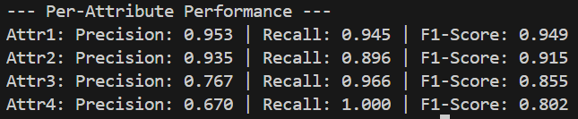

# Deliverables

1. **`train.py`:** This script serves as the main entry point for the training pipeline. It ingests the raw images and the `labels.txt` file, processes them through the two-phase fine-tuning architecture, and outputs the final model weights.

2. **`outputs/loss_curve.png`:** This plot captures the loss progression across both the initial warm-up and the subsequent fine-tuning phase.

3. **`inference.py`:** A standalone script that takes a single image path as a command-line argument. It loads the saved weights, processes the image, and prints the list of detected attributes based on a calibrated probability threshold.

# Evaluation

The model was evaluated using a specialized validation script that accounts for the dataset's unique challenges. Instead of using simple accuracy—which can be misleading on imbalanced data—I focused on Precision, Recall, and F1-Score for each attribute. Crucially, the evaluation logic mirrors the training logic by masking out "NA" values, ensuring the metrics are calculated only against verified ground-truth labels.

# Tech Stack 

Built with Python using TensorFlow/Keras for the EfficientNet-B0 architecture, utilizing OpenCV/PIL for image processing and Matplotlib for training visualization.

# Architectural Strategy & Problem Solving

Here is a breakdown of the engineering decisions behind this project.

## 1. Choosing the Architecture

I went with **Transfer Learning** using the `EfficientNet-B0` architecture. I chose it because it is modern, and a balance of high accuracy and exceptional computational efficiency.

* **The Base:** I started with pre-trained ImageNet weights and chopped off the top classification layer.

* **The Custom Head:** Added a `GlobalAveragePooling2D` layer, dropped in a `Dropout(0.3)` layer to keep things regularized, and finished with a 4-neuron `Dense` layer to predict our specific attributes.

* **Two-Phase Fine-Tuning:**

  1. **Warm-up (5 epochs):** I trained the new custom head. If you don't do this, the random initial weights in the new head will send massive errors backward and scramble the pre-trained brain of the base model.

  2. **Fine-Tuning:** Unfroze the top 27 layers of the base model, dropped the learning rate from `1e-3` to `1e-4`, and let the network deeply adapt to my specific dataset. I also tied this to an Early Stopping callback so it would quit exactly when it stopped improving.

## 2. Dealing with Missing Data ("NA" Values)

A lot of images had "NA" instead of a 1 or 0 for certain attributes. Throwing those images away felt like a huge waste of data, but replacing "NA" with a `0` would introduce false negatives and teach the model the wrong patterns.

**The Fix: A Custom Masked Loss Function**

During data parsing, I converted all "NA" strings to `-1.0`. Then, I wrote a TensorFlow loss function that uses a boolean mask to literally zero out the loss for any `-1.0` label. This mathematically forces the network to only update its weights based on the known data in an image, cleanly skipping over the gaps.

## 3. Tackling the Class Imbalance

Some attributes were everywhere, while others were extremely rare. If left alone, the model would just take the lazy route: guess the common attributes every time and ignore the rare ones entirely.

* **Dynamic Class Weighting:** I set up the data pipeline to calculate the exact rarity of each attribute right before training starts. Rare attributes were handed massive penalty weight multipliers.

* **Masked Focal Loss:** To keep those massive weights from violently destabilizing the training loop, I upgraded my custom loss function to **Focal Loss**.  It dynamically shrinks the error penalty for the easy, common attributes, forcing the optimizer to spend all its energy learning the rare, difficult classes.

## 4. Pre-processing & Augmentations

To make sure the model actually learned what the attributes look like—instead of just lazily memorizing the pixel layouts of the training images—I baked data augmentation directly into the TensorFlow graph using Keras layers:

* `RandomFlip("horizontal_and_vertical")`
* `RandomRotation(0.2)`

This means the model never sees the exact same image twice during training.

## 5. What I'd Do With More Time

If I had more time to improve the model further, here is how I'd push the accuracy even more:

* **Threshold Calibration:** Instead of using a flat 50% cutoff to decide if an attribute is present, I would use a validation set to plot a Precision-Recall curve and mathematically calculate the perfect independent probability threshold for *each* of the 4 attributes.

* **Advanced Augmentation:** Implementing Cutout (blocking out random squares of the input image) would force the network to look at the entire context of the image rather than hyper-fixating on a single distinguishing feature.

* **MLSMOTE:** For the extremely rare classes, I'd apply the Multi-Label Synthetic Minority Over-sampling Technique to synthetically generate brand new feature combinations before training.
